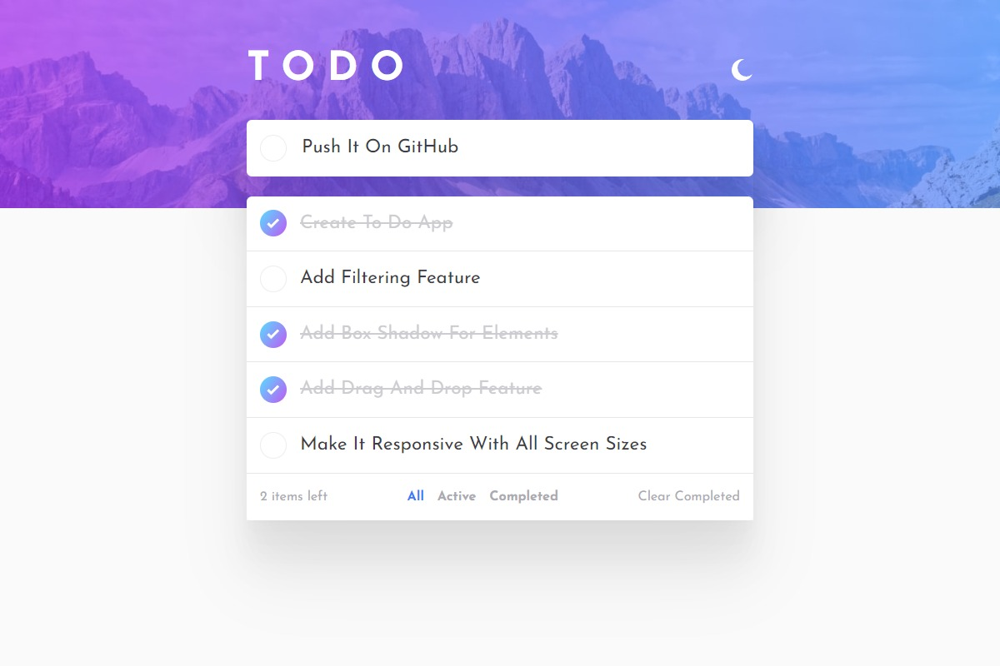

# To-Do App using pug, sass, js

In this project, I developed a frontend To-Do app using Pug, Sass, and JavaScript. The app incorporates both light and dark themes, which are dynamically applied by modifying the classes on the body element to change color variables.

One of the exciting features of this app is the drag and drop functionality, which allows users to rearrange tasks by simply dragging and dropping them. Implementing this feature was a new and challenging experience for me.

Additionally, the app includes a filter option that allows users to view specific subsets of tasks. Incorporating the drag and drop functionality with the filtered tasks proved to be quite challenging. To overcome this, I implemented a solution where tasks are reordered when filters are removed, displaying non-completed tasks first followed by completed tasks.

Overall, this project has been a great opportunity for me to explore and utilize Pug, Sass, and JavaScript in building a functional and visually appealing frontend To-Do app.
